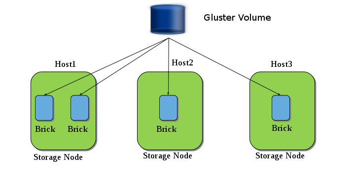

### What is Glusterfs :-
Glusterfs is open source Distributed file system to store multiple petabytes of data.
Glusterfs consists gluster volume:-
Gluster volume is collection of servers belonging to trusted pool.

